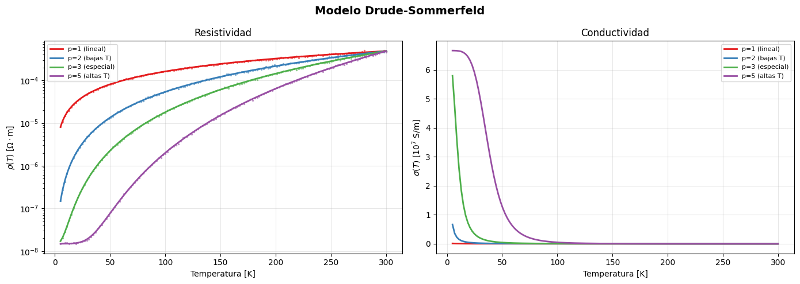
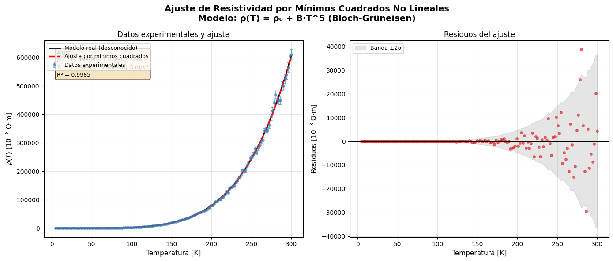
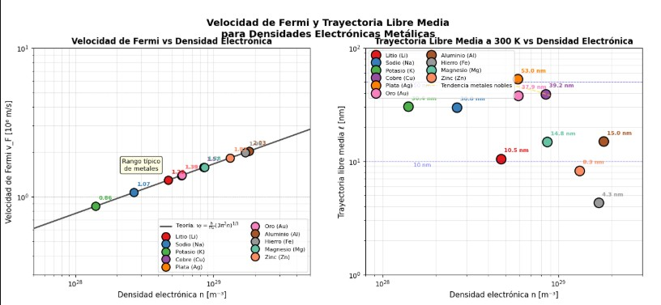

## Electronic Transport in the Drude-Sommerfeld Model and Electron-Phonon Competition

This repository contains a computational simulation environment developed in Python to model, analyze, and tune the electronic transport properties in metallic materials under the framework of the Drude-Sommerfeld quantum model and electron-phonon scattering phenomena.

Electronic transport and electron-phonon competition are a branch of study in hardware development. To give you an idea, transistor construction operates at the nanometer scale, where electrons violently collide with the phonons of the silicon crystal lattice. This generates electrical resistance and, consequently, extreme heating. Controlling electron-phonon competition is what allows for the creation of faster processors without them melting. This project is a generalized theoretical/computational approach to the study of solid-state physics for its applicability in the fabrication of efficient technologies.

# Analytical Results
## Simulation $\rho(T)=1/\sigma(T)$ for different exponents and parameters.

We can observe that all resistivities start from the same residual resistivity value $\rho_{0}$, which is a product of the elastic scattering of electrons by static imperfections in the crystal lattice. We observe that this resistance is independent of temperature up to zero, exclusively in the case of superconductors $(T=0)$. Each value of $p$ represents the resistivity behavior according to the model; for example, at $p=1$ it exhibits linear behavior, which is typical for superconductors. At $p=2$, it is established in the low-temperature regime, where electron-electron scattering mediated by phonons dominates, and the Debye temperature also dominates in this regime. $p=3$ is defined as a special case, because it appears in metals with particular electronic structures. But the most important case occurs at $p=5$, where the classical high-temperature limit for metals is present, corresponding to the Bloch-Grüneisen model. We observe the behavior of conductivity based on the resistance obtained according to its parameter $p$.

At low temperatures, all cases converge to a high conductivity value, indicating that temperature is a limiting factor in electrical conduction, which gives rise to superconductors.
## Fit synthetic resistivity data generated with noise and recover using nonlinear least squares

Electrical resistivity exhibits a nonlinear dependence on temperature that deviates radically from the predictions of a purely classical model. We observe that at low temperatures, resistivity remains practically constant, with the resistivity being $\rho_{0}$. Here, we can understand, in a simplified way, the $T^5$ dependence characteristic of the Bloch-Grüneisen regime. This curvature is the progressive excitation of the phonon modes of the crystal lattice. The phonons begin to populate according to Bose-Einstein statistics, and in doing so, they create an increasingly intense scattering potential for the electrons, as discussed in the theoretical section.
In the graph on the right, the red dots represent the discrepancy between the resistance values ​​obtained experimentally and the equation $\rho(T)= \rho_{0}+BT^5$. The key feature of this graph is the small margin of discrepancy between the low and high temperature regions, where most of the red dots do not exceed the threshold limit in the $2\sigma$ regime. Furthermore, we can observe that there is no sequence or pattern in these discrepancies. If such a pattern existed, it would indicate phenomena not considered in the Bloch-Grüneisen model, but we know that this model accurately represents the experimental results when $p=5$. Finally, this demonstrates that our model, based on Fermi-Dirac statistics for electrons and Bose-Einstein statistics for phonons, along with Matthiessen's rule for combining scattering mechanisms, accurately captures the essence of electrical transport in metals at the macroscopic level.
## Fermi velocity and mean free path for metallic electron densities

In the graph on the left, we see the behavior of the Fermi velocity as a function of electron density in different metals, where each metal has a specific electron density. This allows us to compare and conclude that the Fermi velocity does not depend on temperature, but rather directly on the electron density. The graph on the right demonstrates that this validates Bloch's theorem, which states that in a perfect periodic potential, the electron wave function is a stationary state with a well-defined wave vector $k$, a consequence of the perfect crystal case where electrons do not scatter with the ions.

